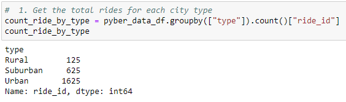
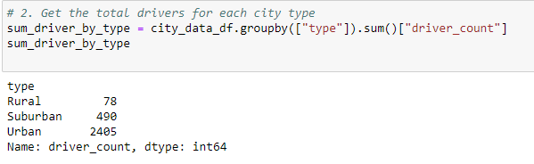
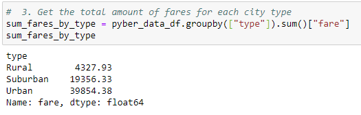
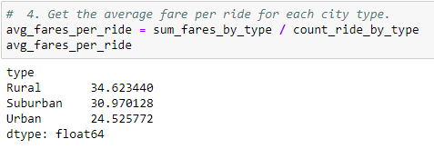
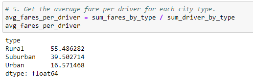
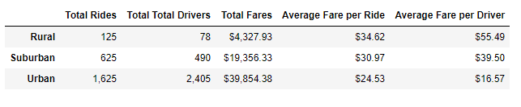
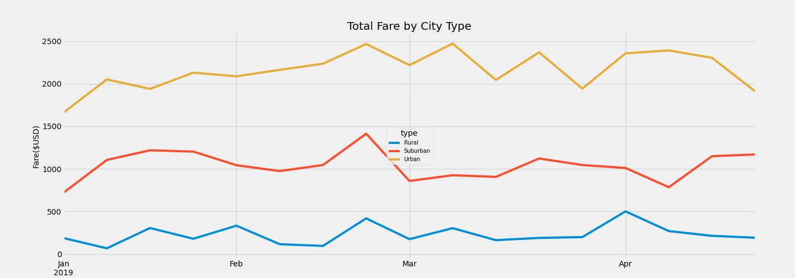

# PyBer_Analysis
Analyzing rideshare data for a four-month period (January 2019 to April 2019) and create visualization for PyBer management team

## Project Overview
This project will be using Python and Pandas to create a summary DataFrame of the ride-sharing data by city type. Then, using Pandas and Matplotlib, a multiple-line graph will be created that shows the total weekly fares for each city type. This assignment consists of two technical deliverables. They are:

1. A ride-sharing summary DataFrame by city type
2. A multiple-line chart of total fares for each city type

Working with the `PyBer_Challenge.ipynb` starter code, Pandas `loc`, `groubby()`, `count()`, `sum()`, `resample()` method and `pivot()` function will be used to find the requested results. The results will be printed to the command line and saved to file `PyBer_Challenge.ipynb`. An annotated chart showing the total fares by city type will also be creaated to visualize said results.

## Purpose
The purpose of this analysis is to perform an exploratory analysis for PyBer to help improve access to ride-sharing services of PyBer as well as to determine the affordability across different city type (rural, suburban, and urban).

## Resources
- **Data Source:** PyBer_Challenge.ipynb, city_data.csv, ride_data.csv
- **Software:** Anaconda 4.8.3, Jupyter Notebook 6.0.3, Visual Code 1.47, Python 3.7.6

## PyBer Analysis Results
The analysis of PyBer ride sharing services was performed on dataset for a four-month period (January 2019 and end of April 2019). First the dataset was inspected, then merged into one, afterwhich calculations were performed to analyze the total rides, total drivers, total fares, average fare per ride and driver, and total fare by city type. A summary dataframe was created that was used to build a multi-line chart. Steps taken to accomplish the analysis perfomed are outlined in detail in the `PyBer_Challenge.ipynb` file.
>
>
### **The Total Rides Results**
>The **urban** city type has the largest amount (`1,625`) of rides compared to all other city type, also if we examine the total amount of rides for each city type, we'll notice that the total rides in the **rural** cities is about `5` and `13` times lower than suburban and urban cities, respectively. The results are as follows: 
>- Rural: `125` rides, 
>- Suburban: `625` rides, and 
>- Urban:  `1,625` rides
>
>To compute the total rides, the `groupby()` function was used to create a Series of data that has the name of the city as the index, then apply the `count()` method to the `"ride_id"` column. Please see image below for code:
>
>**Table showing the total rides per city type from the Terminal:**
>
>

### **The Total Drivers Results**
>The **urban** city type has the largest amount (`2,405`) of drivers compared to all other city type, also if we examine the total amount of drivers for each city type, we'll notice that the total drivers in the **rural** cities is about `6.3` and `30.8` times lower than suburban and urban cities, respectively. The results are as follows: 
>- Rural: `78` drivers, 
>- Suburban: `490` drivers, and 
>- Urban:  `2,405` drivers
>
>To compute the total drivers, the `groupby()` function was used to create a Series of data that has the name of the city as the index, then apply the `sum()` method to the `"driver_count"` column. Please see image below for code:
>
>**Table showing the Total Drivers per city type from the Terminal:**
>
>

### **The Total Fares Results**
>The **urban** city type has the largest amount (`39,854.38`) of fare compared to all other city type, also if we examine the total amount of fares for each city type, we'll notice that the total fares in the **rural** cities is about `4.5` and `9.2` times lower than suburban and urban cities, respectively. This could mean that the urban area is most profitable among the three and rural city the least profitable. The results are as follows: 
>- Rural: `4,327.93` fares, 
>- Suburban: `19,356.33` fares, and 
>- Urban:  `39,854.38` fares
>
>To compute the total fares, the `groupby()` function was used to create a Series of data that has the name of the city as the index, then apply the `sum()` method to the `"fare"` column. Please see image below for code:
>
>**Table showing the Total Fares per city type from the Terminal:**
>
>

>**The Average Fare per Ride Results**
>
>If we compare the average fare per ride between each city type, we'll notice that the average number of rides in the **urban** cities is about `1.4` and `1.3` times lower than rural and suburban cities, respectively. The results are as follows: 
>- Rural: `34.62` fares, 
>- Suburban: `30.97` fares, and 
>- Urban:  `24.53` fares
>
>The average fares per ride by city type was computed by dividing the **sum of all the fares** by the **total rides**. Please see image below for code:
>
>**Table showing the Average fare per ride from the Terminal:**
>
>

>**The Average Fare per Driver Results**
>
>If we compare the average fare per driver between each city type, we we will notice that the average number of rides in the **urban** cities is about `3.3` and `2.4` times lower than rural and suburban cities, respectively. The results are as follows: 
>- Rural: `55.49` drivers, 
>- Suburban: `39.50` drivers, and 
>- Urban:  `16.57` drivers
>
>The average fares per driver by city type was computed by dividing the **sum of all the fares** by the **total drivers**. Please see image below for code:
>
>**Table showing the Average fare per driver from the Terminal:**
>
>

>**The Total Fare by City Type**
>
>The table below indicates that the Rural city type has the highest average fare per ride compared to the other two (urban and suburban) city type. On the other hand, the urban city type had the lowest among the three. This indicates that the rural city drivers will generate more revenue for each trip due to the fact that their average fare is `3` times more than the urban city type and their total number of drivers is low (`30.8` times lower).
>
>Though, urban city type is observed to having the lowest among the three as it relates to average fare per ride and driver, we can also observe that it too has the highest ride and driver volumes which indicates that this city type is the most profitable (over time - see chart below) of them all. This is also backed up by the total fares in the the summary table below which shows the urban city type generating a total revenue of `$39,854.38` USD. 
>
>
>**Table showing the Summary table by city type from the Terminal:**
>
>
>
>
>The multi-line chart below helps to visualize the fare ($USD) dataset. Here, focus is placed on a four-month period (between January 2019 to the end of April 2019). If we compare total fare by city type, we can see that the rural city type had the highest fare by city type, and urban the lowest. This translate to rural city type generating more cash per ride. Overtime we can also see that the urban cities generate more income as their rides are higher, compared to all city type.
>
>**Multi-line Chart showing the total fare by city type from January 2019 to the end of April 2019:**
>
>
  
## PyBer Ride-Sharing Summary
>**Three business recommendations to the CEO for addressing any disparities among the city types. They are:**
>
>
>1. The multi-line chart generated shows a significant increase in the last week of February and a decrease the following week. The recommendation would be to analyze data from a wider period could uncover some trends caused by the time of the year studied that cannot be determined in four-months range.
>
>
>2. There seems to be a significant increase in the number of drivers in the urban city type as compared to the others. This data set does not tell us why this is so. What is the driving force behind this number? What is correlation with the population? The suggestion would be to merge population data from census to then visualize and analyze whether they coorelates and look for trends.
>
>
>3. There should also be an exploratory analysis conducted on distance travelled, and the effect it has on price. Information should be gathered on each rider pick up and drop off location.
>
>
>4. Last an exploratory analysis should be done on fare to determine whether PyBer is offering competive fares as it relates to other competitors. This could be used as a benchmark when determining fares, so that Pyber does not over or under charge and remains "fair" in the eyes of the customer.
